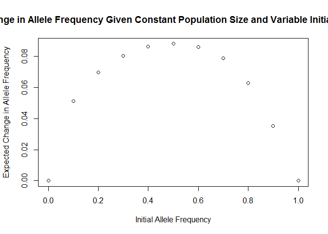

# Population Genetics Problem Set 2
# Sydney Wyatt  
### May 1, 2017  


### Question 1

**A) Use a program such as R or Excel to generate a scatter plot that shows how expected allele frequency change from genetic drift depends on initial allele frequency. The x-axis should be initial allele frequency and range from 0 to 1. The y-axis should be expected change in allele frequency after one generation. Perform calculations in steps of 0.1 for a population size of 2N=20.**  

```r
#Define function calculating expected delta f given initial allele f (fG1)
Expected.delta.f <- function(fG1) {
  #Create and empty data frame that you will eventually fill in
  delta.f.values = as.data.frame(cbind(rep(NA,21), rep(NA,21)))
  #Loop through all possible number of alleles given N = 10 and fill in the data frame
  for(i in 0:20){
    delta.f = i/20
    if(0< (fG1 + delta.f) & (fG1+delta.f) <=1){
      fG2 = fG1 + delta.f
      n = fG2*(2*N)
      P.deltaf.isX.a = dbinom(n, size = (2*N), prob = fG1)}
    else {
      P.deltaf.isX.a = 0}
    if(0<= (fG1 + delta.f) & (fG1+delta.f) <1){
      fG2 = fG1 - delta.f
      n = fG2*(2*N)
      P.deltaf.isX.b = dbinom(n, size = (2*N), prob = fG1)}
    else {
      P.deltaf.isX.b = 0}
    P.deltaf.isX = P.deltaf.isX.a + P.deltaf.isX.b
    delta.f.values[i+1,1] = delta.f
    delta.f.values[i+1,2] = P.deltaf.isX}
  #The data frame is full, now multiply the frequency (delta.f.values$V1) by the probability of X = x (delta.f.values$V2) and sum
  sum(delta.f.values$V1 * delta.f.values$V2)
}

N = 10
#Hold our values for the graph
Values.for.graph = as.data.frame(cbind(rep(NA, 11), rep(NA, 11)))

#Now, find the expected change in f for initial allele frequencies 0-1
for(i in 0:10){
  fG1 = i/10
  Values.for.graph[i+1, 1] = fG1
  Values.for.graph[i+1, 2] = Expected.delta.f(fG1)}

#Graph
plot(Values.for.graph, xlab = "Initial Allele Frequency", ylab = "Expected Change in Allele Frequency", main = "Expected Change in Allele Frequency Given Constant Population Size and Variable Initial Allele Frequency")
```

<!-- -->


**B) Use the same program to generate a scatter plot that shows how expected allele frequency change from genetic drift depends on population size. The x-axis should be population size and range from 2N=10 to 2N=100. The y-axis should be expected change in allele frequency after one generation. Perform calculations in steps of 10 with an allele frequency of 0.5.**  

```r
allele.freq = 0.5
initial.size = c(10,20,30,40,50,60,70,80,90,100)
pop.size.change = c(0,10,20,30,40,50,60,70,80,90,100)
Expected.change.pop = c()
```


### Question 2  

**A) Use the same program to generate a scatter plot that shows the properties of selection in large populations. The x-axis should be frequency of the advantageous allele and range from 0 to 1. The y-axis should be the change in frequency of the advantageous allele after one generation of selection. Perform calculations in steps of 0.01 for each of the following six (1a, 1b, 1c, 2a, 2b, 2c) scenarios: (1) the homozygous deleterious genotype has a selection coefficient of 0.1 and the advantageous allele is (a) recessive, (b) dominant or (c) additive; (2) the homozygous deleterious genotype has a selection coefficient of 0.25 and the advantageous allele is (a) recessive, (b) dominant or (c) additive.**  


```r
#Define function for recessive advantageous allele given S of "bad" genotype & frequency of "good" allele
recessive <- function(Sb, fg) {
  Sg = 0
  Shet = Sb
  fb = 1 - fg
  New.freq = ((fg^2)*(1-Sg)+(fg)*(fb)*(1-Shet))/((fg^2)*(1-Sg)+2*(fg)*(fb)*(1-Shet)+(fb^2)*(1-Sb))
  Change.in.freq = New.freq - fg
  return(Change.in.freq)
}

#Define function for dominant advantageous allele given S of "bad" genotype & frequency of "good" allele
dominant <- function(Sb, fg) {
  Sg = Shet = 0
  fb = 1 - fg
  New.freq = ((fg^2)*(1-Sg)+(fg)*(fb)*(1-Shet))/((fg^2)*(1-Sg)+2*(fg)*(fb)*(1-Shet)+(fb^2)*(1-Sb))
  Change.in.freq = New.freq - fg
  return(Change.in.freq)
}

#Define function for additive advantageous allele given S of "bad" genotype & frequency of "good" allele
#Assuming that selection for heterozygotes is half of the "bad" genotype's selection
additive <- function(Sb, fg) {
  Sg = 0
  Shet = 0.5*Sb
  fb = 1 - fg
  New.freq = ((fg^2)*(1-Sg)+(fg)*(fb)*(1-Shet))/((fg^2)*(1-Sg)+2*(fg)*(fb)*(1-Shet)+(fb^2)*(1-Sb))
  Change.in.freq = New.freq - fg
  return(Change.in.freq)
}
```


```r
#Now we use the above functions to calculate frequency of "good" allele in next generation

#Define allele frequency (This changes!)
good.allele.freq = seq(0,1, by = 0.01)   #0, 0.01, 0.02, ..... 1
bad.S = 0.1

#If "good" allele is recessive:
NextGenfreq.recessive = c()
for(i in good.allele.freq){
  f = recessive(bad.S, i)
  NextGenfreq.recessive = append(NextGenfreq.recessive, f)
}

#Try later
#rainbowCats(good.allele.freq, NextGenfreq.recessive, ptsize = 0.1, yspread = 0.1, xspread = 0.1, cat = 11, catshiftfix = 0, catshifty = 0, canvas = c(0, 1.5, 0, 1.5))

#plot it!
catplot(good.allele.freq, NextGenfreq.recessive, size = 0.1, cat = 11, xlab = "Initial Allele Frequency", ylab = "Change in Allele Frequency", main = "1a: S = 0.1, allele is recessive")
```

<!-- -->

```
## $xs
##   [1] 0.00 0.01 0.02 0.03 0.04 0.05 0.06 0.07 0.08 0.09 0.10 0.11 0.12 0.13
##  [15] 0.14 0.15 0.16 0.17 0.18 0.19 0.20 0.21 0.22 0.23 0.24 0.25 0.26 0.27
##  [29] 0.28 0.29 0.30 0.31 0.32 0.33 0.34 0.35 0.36 0.37 0.38 0.39 0.40 0.41
##  [43] 0.42 0.43 0.44 0.45 0.46 0.47 0.48 0.49 0.50 0.51 0.52 0.53 0.54 0.55
##  [57] 0.56 0.57 0.58 0.59 0.60 0.61 0.62 0.63 0.64 0.65 0.66 0.67 0.68 0.69
##  [71] 0.70 0.71 0.72 0.73 0.74 0.75 0.76 0.77 0.78 0.79 0.80 0.81 0.82 0.83
##  [85] 0.84 0.85 0.86 0.87 0.88 0.89 0.90 0.91 0.92 0.93 0.94 0.95 0.96 0.97
##  [99] 0.98 0.99 1.00
## 
## $ys
##   [1] 0.000000e+00 1.099988e-05 4.355362e-05 9.699030e-05 1.706363e-04
##   [6] 2.638156e-04 3.758497e-04 5.060578e-04 6.537573e-04 8.182636e-04
##  [11] 9.988901e-04 1.194949e-03 1.405751e-03 1.630605e-03 1.868819e-03
##  [16] 2.119701e-03 2.382556e-03 2.656691e-03 2.941411e-03 3.236020e-03
##  [21] 3.539823e-03 3.852125e-03 4.172229e-03 4.499442e-03 4.833068e-03
##  [26] 5.172414e-03 5.516785e-03 5.865490e-03 6.217836e-03 6.573133e-03
##  [31] 6.930693e-03 7.289828e-03 7.649851e-03 8.010078e-03 8.369828e-03
##  [36] 8.728419e-03 9.085174e-03 9.439416e-03 9.790473e-03 1.013767e-02
##  [41] 1.048035e-02 1.081784e-02 1.114947e-02 1.147459e-02 1.179255e-02
##  [46] 1.210269e-02 1.240436e-02 1.269692e-02 1.297972e-02 1.325213e-02
##  [51] 1.351351e-02 1.376324e-02 1.400069e-02 1.422524e-02 1.443627e-02
##  [56] 1.463316e-02 1.481532e-02 1.498214e-02 1.513303e-02 1.526738e-02
##  [61] 1.538462e-02 1.548415e-02 1.556541e-02 1.562781e-02 1.567080e-02
##  [66] 1.569382e-02 1.569630e-02 1.567770e-02 1.563747e-02 1.557508e-02
##  [71] 1.548999e-02 1.538168e-02 1.524962e-02 1.509331e-02 1.491223e-02
##  [76] 1.470588e-02 1.447377e-02 1.421541e-02 1.393031e-02 1.361800e-02
##  [81] 1.327801e-02 1.290987e-02 1.251313e-02 1.208734e-02 1.163205e-02
##  [86] 1.114682e-02 1.063124e-02 1.008486e-02 9.507284e-03 8.898091e-03
##  [91] 8.256881e-03 7.583256e-03 6.876828e-03 6.137214e-03 5.364037e-03
##  [96] 4.556930e-03 3.715530e-03 2.839481e-03 1.928437e-03 9.820543e-04
## [101] 0.000000e+00
## 
## $args
## $args$xlab
## [1] "Initial Allele Frequency"
## 
## $args$ylab
## [1] "Change in Allele Frequency"
## 
## $args$main
## [1] "1a: S = 0.1, allele is recessive"
## 
## 
## $canvas
## [1] 0.0 1.1 0.0 1.1
```

```r
#If "good" allele is dominant:
NextGenfreq.dominant = c()
for(i in good.allele.freq){
  f = dominant(bad.S, i)
  NextGenfreq.dominant = append(NextGenfreq.dominant, f)
}

catplot(good.allele.freq, NextGenfreq.dominant, size = 0.1, cat = 11, xlab = "Initial Allele Frequency", ylab = "Change in Allele Frequency", main = "1b: S = 0.1, allele is dominant")
```

<!-- -->

```
## $xs
##   [1] 0.00 0.01 0.02 0.03 0.04 0.05 0.06 0.07 0.08 0.09 0.10 0.11 0.12 0.13
##  [15] 0.14 0.15 0.16 0.17 0.18 0.19 0.20 0.21 0.22 0.23 0.24 0.25 0.26 0.27
##  [29] 0.28 0.29 0.30 0.31 0.32 0.33 0.34 0.35 0.36 0.37 0.38 0.39 0.40 0.41
##  [43] 0.42 0.43 0.44 0.45 0.46 0.47 0.48 0.49 0.50 0.51 0.52 0.53 0.54 0.55
##  [57] 0.56 0.57 0.58 0.59 0.60 0.61 0.62 0.63 0.64 0.65 0.66 0.67 0.68 0.69
##  [71] 0.70 0.71 0.72 0.73 0.74 0.75 0.76 0.77 0.78 0.79 0.80 0.81 0.82 0.83
##  [85] 0.84 0.85 0.86 0.87 0.88 0.89 0.90 0.91 0.92 0.93 0.94 0.95 0.96 0.97
##  [99] 0.98 0.99 1.00
## 
## $ys
##   [1] 0.000000e+00 1.086597e-03 2.124873e-03 3.115872e-03 4.060627e-03
##   [6] 4.960154e-03 5.815453e-03 6.627514e-03 7.397308e-03 8.125797e-03
##  [11] 8.813928e-03 9.462635e-03 1.007284e-02 1.064545e-02 1.118137e-02
##  [16] 1.168149e-02 1.214667e-02 1.257778e-02 1.297569e-02 1.334122e-02
##  [21] 1.367521e-02 1.397850e-02 1.425188e-02 1.449618e-02 1.471218e-02
##  [26] 1.490066e-02 1.506242e-02 1.519821e-02 1.530881e-02 1.539496e-02
##  [31] 1.545741e-02 1.549691e-02 1.551418e-02 1.550994e-02 1.548492e-02
##  [36] 1.543983e-02 1.537538e-02 1.529225e-02 1.519115e-02 1.507276e-02
##  [41] 1.493776e-02 1.478683e-02 1.462064e-02 1.443985e-02 1.424513e-02
##  [46] 1.403712e-02 1.381649e-02 1.358387e-02 1.333991e-02 1.308525e-02
##  [51] 1.282051e-02 1.254634e-02 1.226335e-02 1.197217e-02 1.167341e-02
##  [56] 1.136770e-02 1.105564e-02 1.073784e-02 1.041492e-02 1.008747e-02
##  [61] 9.756098e-03 9.421399e-03 9.083973e-03 8.744411e-03 8.403307e-03
##  [66] 8.061250e-03 7.718830e-03 7.376632e-03 7.035241e-03 6.695241e-03
##  [71] 6.357215e-03 6.021743e-03 5.689405e-03 5.360780e-03 5.036446e-03
##  [76] 4.716981e-03 4.402961e-03 4.094962e-03 3.793561e-03 3.499332e-03
##  [81] 3.212851e-03 2.934694e-03 2.665436e-03 2.405652e-03 2.155919e-03
##  [86] 1.916813e-03 1.688910e-03 1.472789e-03 1.269027e-03 1.078205e-03
##  [91] 9.009009e-04 7.376975e-04 5.891771e-04 4.559234e-04 3.385219e-04
##  [96] 2.375594e-04 1.536246e-04 8.730786e-05 3.920157e-05 9.900099e-06
## [101] 0.000000e+00
## 
## $args
## $args$xlab
## [1] "Initial Allele Frequency"
## 
## $args$ylab
## [1] "Change in Allele Frequency"
## 
## $args$main
## [1] "1b: S = 0.1, allele is dominant"
## 
## 
## $canvas
## [1] 0.0 1.1 0.0 1.1
```

```r
#If "good" allele is additive:
NextGenfreq.additive = c()
for(i in good.allele.freq){
  f = additive(bad.S, i)
  NextGenfreq.additive = append(NextGenfreq.additive, f)
}

catplot(good.allele.freq, NextGenfreq.additive, size = 0.1, cat = 11,  xlab = "Initial Allele Frequency", ylab = "Change in Allele Frequency", main = "1c: S = 0.1, allele is additive")
```

<!-- -->

```
## $xs
##   [1] 0.00 0.01 0.02 0.03 0.04 0.05 0.06 0.07 0.08 0.09 0.10 0.11 0.12 0.13
##  [15] 0.14 0.15 0.16 0.17 0.18 0.19 0.20 0.21 0.22 0.23 0.24 0.25 0.26 0.27
##  [29] 0.28 0.29 0.30 0.31 0.32 0.33 0.34 0.35 0.36 0.37 0.38 0.39 0.40 0.41
##  [43] 0.42 0.43 0.44 0.45 0.46 0.47 0.48 0.49 0.50 0.51 0.52 0.53 0.54 0.55
##  [57] 0.56 0.57 0.58 0.59 0.60 0.61 0.62 0.63 0.64 0.65 0.66 0.67 0.68 0.69
##  [71] 0.70 0.71 0.72 0.73 0.74 0.75 0.76 0.77 0.78 0.79 0.80 0.81 0.82 0.83
##  [85] 0.84 0.85 0.86 0.87 0.88 0.89 0.90 0.91 0.92 0.93 0.94 0.95 0.96 0.97
##  [99] 0.98 0.99 1.00
## 
## $ys
##   [1] 0.0000000000 0.0005493896 0.0010864745 0.0016112957 0.0021238938
##   [6] 0.0026243094 0.0031125828 0.0035887541 0.0040528634 0.0045049505
##  [11] 0.0049450549 0.0053732162 0.0057894737 0.0061938664 0.0065864333
##  [16] 0.0069672131 0.0073362445 0.0076935660 0.0080392157 0.0083732318
##  [21] 0.0086956522 0.0090065147 0.0093058568 0.0095937161 0.0098701299
##  [26] 0.0101351351 0.0103887689 0.0106310680 0.0108620690 0.0110818084
##  [31] 0.0112903226 0.0114876477 0.0116738197 0.0118488746 0.0120128480
##  [36] 0.0121657754 0.0123076923 0.0124386339 0.0125586354 0.0126677316
##  [41] 0.0127659574 0.0128533475 0.0129299363 0.0129957582 0.0130508475
##  [46] 0.0130952381 0.0131289641 0.0131520591 0.0131645570 0.0131664910
##  [51] 0.0131578947 0.0131388013 0.0131092437 0.0130692550 0.0130188679
##  [56] 0.0129581152 0.0128870293 0.0128056426 0.0127139875 0.0126120959
##  [61] 0.0125000000 0.0123777315 0.0122453222 0.0121028037 0.0119502075
##  [66] 0.0117875648 0.0116149068 0.0114322647 0.0112396694 0.0110371517
##  [71] 0.0108247423 0.0106024717 0.0103703704 0.0101284687 0.0098767967
##  [76] 0.0096153846 0.0093442623 0.0090634596 0.0087730061 0.0084729316
##  [81] 0.0081632653 0.0078440367 0.0075152749 0.0071770092 0.0068292683
##  [86] 0.0064720812 0.0061054767 0.0057294833 0.0053441296 0.0049494439
##  [91] 0.0045454545 0.0041321897 0.0037096774 0.0032779456 0.0028370221
##  [96] 0.0023869347 0.0019277108 0.0014593781 0.0009819639 0.0004954955
## [101] 0.0000000000
## 
## $args
## $args$xlab
## [1] "Initial Allele Frequency"
## 
## $args$ylab
## [1] "Change in Allele Frequency"
## 
## $args$main
## [1] "1c: S = 0.1, allele is additive"
## 
## 
## $canvas
## [1] 0.0 1.1 0.0 1.1
```

```r
#Now we have a new S!
bad.S = 0.25

#Copy the previous code and relabel the graphs.
#If "good" allele is recessive:
NextGenfreq.recessive = c()
for(i in good.allele.freq){   #iterate over the different "good" allele frequencies
  f = recessive(bad.S, i)
  NextGenfreq.recessive = append(NextGenfreq.recessive, f)
}

#plot it!
catplot(good.allele.freq, NextGenfreq.recessive, size = 0.1, cat = 11, xlab = "Initial Allele Frequency", ylab = "Change in Allele Frequency", main = "2a: S = 0.25, allele is recessive")
```

<!-- -->

```
## $xs
##   [1] 0.00 0.01 0.02 0.03 0.04 0.05 0.06 0.07 0.08 0.09 0.10 0.11 0.12 0.13
##  [15] 0.14 0.15 0.16 0.17 0.18 0.19 0.20 0.21 0.22 0.23 0.24 0.25 0.26 0.27
##  [29] 0.28 0.29 0.30 0.31 0.32 0.33 0.34 0.35 0.36 0.37 0.38 0.39 0.40 0.41
##  [43] 0.42 0.43 0.44 0.45 0.46 0.47 0.48 0.49 0.50 0.51 0.52 0.53 0.54 0.55
##  [57] 0.56 0.57 0.58 0.59 0.60 0.61 0.62 0.63 0.64 0.65 0.66 0.67 0.68 0.69
##  [71] 0.70 0.71 0.72 0.73 0.74 0.75 0.76 0.77 0.78 0.79 0.80 0.81 0.82 0.83
##  [85] 0.84 0.85 0.86 0.87 0.88 0.89 0.90 0.91 0.92 0.93 0.94 0.95 0.96 0.97
##  [99] 0.98 0.99 1.00
## 
## $ys
##   [1] 0.0000000000 0.0000329989 0.0001306492 0.0002909127 0.0005117271
##   [6] 0.0007910075 0.0011266480 0.0015165230 0.0019584886 0.0024503840
##  [11] 0.0029900332 0.0035752465 0.0042038217 0.0048735457 0.0055821963
##  [16] 0.0063275434 0.0071073506 0.0079193767 0.0087613771 0.0096311057
##  [21] 0.0105263158 0.0114447620 0.0123842015 0.0133423958 0.0143171115
##  [26] 0.0153061224 0.0163072108 0.0173181685 0.0183367983 0.0193609157
##  [31] 0.0203883495 0.0214169439 0.0224445591 0.0234690727 0.0244883811
##  [36] 0.0255004003 0.0265030675 0.0274943415 0.0284722046 0.0294346626
##  [41] 0.0303797468 0.0313055143 0.0322100491 0.0330914628 0.0339478958
##  [46] 0.0347775176 0.0355785278 0.0363491571 0.0370876672 0.0377923521
##  [51] 0.0384615385 0.0390935861 0.0396868885 0.0402398732 0.0407510026
##  [56] 0.0412187737 0.0416417190 0.0420184066 0.0423474404 0.0426274604
##  [61] 0.0428571429 0.0430352006 0.0431603829 0.0432314758 0.0432473017
##  [66] 0.0432067202 0.0431086273 0.0429519557 0.0427356747 0.0424587900
##  [71] 0.0421203438 0.0417194144 0.0412551160 0.0407265985 0.0401330477
##  [76] 0.0394736842 0.0387477639 0.0379545771 0.0370934486 0.0361637372
##  [81] 0.0351648352 0.0340961680 0.0329571942 0.0317474044 0.0304663212
##  [86] 0.0291134990 0.0276885228 0.0261910085 0.0246206019 0.0229769785
##  [91] 0.0212598425 0.0194689271 0.0176039933 0.0156648296 0.0136512514
##  [96] 0.0115631006 0.0094002448 0.0071625771 0.0048500151 0.0024625009
## [101] 0.0000000000
## 
## $args
## $args$xlab
## [1] "Initial Allele Frequency"
## 
## $args$ylab
## [1] "Change in Allele Frequency"
## 
## $args$main
## [1] "2a: S = 0.25, allele is recessive"
## 
## 
## $canvas
## [1] 0.0 1.1 0.0 1.1
```

```r
#If "good" allele is dominant:
NextGenfreq.dominant = c()
for(i in good.allele.freq){
  f = dominant(bad.S, i)
  NextGenfreq.dominant = append(NextGenfreq.dominant, f)
}

catplot(good.allele.freq, NextGenfreq.dominant, size = 0.1, cat = 11, xlab = "Initial Allele Frequency", ylab = "Change in Allele Frequency", main = "2b: S = 0.25, allele is dominant")
```

<!-- -->

```
## $xs
##   [1] 0.00 0.01 0.02 0.03 0.04 0.05 0.06 0.07 0.08 0.09 0.10 0.11 0.12 0.13
##  [15] 0.14 0.15 0.16 0.17 0.18 0.19 0.20 0.21 0.22 0.23 0.24 0.25 0.26 0.27
##  [29] 0.28 0.29 0.30 0.31 0.32 0.33 0.34 0.35 0.36 0.37 0.38 0.39 0.40 0.41
##  [43] 0.42 0.43 0.44 0.45 0.46 0.47 0.48 0.49 0.50 0.51 0.52 0.53 0.54 0.55
##  [57] 0.56 0.57 0.58 0.59 0.60 0.61 0.62 0.63 0.64 0.65 0.66 0.67 0.68 0.69
##  [71] 0.70 0.71 0.72 0.73 0.74 0.75 0.76 0.77 0.78 0.79 0.80 0.81 0.82 0.83
##  [85] 0.84 0.85 0.86 0.87 0.88 0.89 0.90 0.91 0.92 0.93 0.94 0.95 0.96 0.97
##  [99] 0.98 0.99 1.00
## 
## $ys
##   [1] 0.000000e+00 3.245472e-03 6.319253e-03 9.227224e-03 1.197505e-02
##   [6] 1.456820e-02 1.701194e-02 1.931135e-02 2.147133e-02 2.349664e-02
##  [11] 2.539185e-02 2.716138e-02 2.880952e-02 3.034042e-02 3.175807e-02
##  [16] 3.306636e-02 3.426906e-02 3.536982e-02 3.637216e-02 3.727952e-02
##  [21] 3.809524e-02 3.882254e-02 3.946456e-02 4.002436e-02 4.050491e-02
##  [26] 4.090909e-02 4.123972e-02 4.149952e-02 4.169118e-02 4.181727e-02
##  [31] 4.188034e-02 4.188286e-02 4.182723e-02 4.171581e-02 4.155089e-02
##  [36] 4.133473e-02 4.106952e-02 4.075740e-02 4.040049e-02 4.000083e-02
##  [41] 3.956044e-02 3.908130e-02 3.856535e-02 3.801448e-02 3.743056e-02
##  [46] 3.681542e-02 3.617086e-02 3.549864e-02 3.480051e-02 3.407818e-02
##  [51] 3.333333e-02 3.256762e-02 3.178268e-02 3.098013e-02 3.016155e-02
##  [56] 2.932851e-02 2.848256e-02 2.762523e-02 2.675803e-02 2.588246e-02
##  [61] 2.500000e-02 2.411211e-02 2.322025e-02 2.232585e-02 2.143034e-02
##  [66] 2.053514e-02 1.964164e-02 1.875125e-02 1.786535e-02 1.698532e-02
##  [71] 1.611253e-02 1.524835e-02 1.439412e-02 1.355122e-02 1.272098e-02
##  [76] 1.190476e-02 1.110390e-02 1.031973e-02 9.553599e-03 8.806845e-03
##  [81] 8.080808e-03 7.376826e-03 6.696240e-03 6.040392e-03 5.410628e-03
##  [86] 4.808297e-03 4.234750e-03 3.691346e-03 3.179446e-03 2.700419e-03
##  [91] 2.255639e-03 1.846489e-03 1.474359e-03 1.140647e-03 8.467621e-04
##  [96] 5.941213e-04 3.841537e-04 2.182991e-04 9.800980e-05 2.475062e-05
## [101] 0.000000e+00
## 
## $args
## $args$xlab
## [1] "Initial Allele Frequency"
## 
## $args$ylab
## [1] "Change in Allele Frequency"
## 
## $args$main
## [1] "2b: S = 0.25, allele is dominant"
## 
## 
## $canvas
## [1] 0.0 1.1 0.0 1.1
```

```r
#If "good" allele is additive:
NextGenfreq.additive = c()
for(i in good.allele.freq){
  f = additive(bad.S, i)
  NextGenfreq.additive = append(NextGenfreq.additive, f)
}

#rainbowCats(good.allele.freq, NextGenfreq.additive, ptsize = 1, yspread = 0.05, xspread = 0.05, cat = 11, canvas = c(0,1.5,0,1.5))

catplot(good.allele.freq, NextGenfreq.additive, size = 0.1, cat = 11, xlab = "Initial Allele Frequency", ylab = "Change in Allele Frequency", main = "2c: S = 0.25, allele is additive")
```

<!-- -->

```
## $xs
##   [1] 0.00 0.01 0.02 0.03 0.04 0.05 0.06 0.07 0.08 0.09 0.10 0.11 0.12 0.13
##  [15] 0.14 0.15 0.16 0.17 0.18 0.19 0.20 0.21 0.22 0.23 0.24 0.25 0.26 0.27
##  [29] 0.28 0.29 0.30 0.31 0.32 0.33 0.34 0.35 0.36 0.37 0.38 0.39 0.40 0.41
##  [43] 0.42 0.43 0.44 0.45 0.46 0.47 0.48 0.49 0.50 0.51 0.52 0.53 0.54 0.55
##  [57] 0.56 0.57 0.58 0.59 0.60 0.61 0.62 0.63 0.64 0.65 0.66 0.67 0.68 0.69
##  [71] 0.70 0.71 0.72 0.73 0.74 0.75 0.76 0.77 0.78 0.79 0.80 0.81 0.82 0.83
##  [85] 0.84 0.85 0.86 0.87 0.88 0.89 0.90 0.91 0.92 0.93 0.94 0.95 0.96 0.97
##  [99] 0.98 0.99 1.00
## 
## $ys
##   [1] 0.000000000 0.001644518 0.003245033 0.004801980 0.006315789
##   [6] 0.007786885 0.009215686 0.010602606 0.011948052 0.013252427
##  [11] 0.014516129 0.015739550 0.016923077 0.018067093 0.019171975
##  [16] 0.020238095 0.021265823 0.022255521 0.023207547 0.024122257
##  [21] 0.025000000 0.025841121 0.026645963 0.027414861 0.028148148
##  [26] 0.028846154 0.029509202 0.030137615 0.030731707 0.031291793
##  [31] 0.031818182 0.032311178 0.032771084 0.033198198 0.033592814
##  [36] 0.033955224 0.034285714 0.034584570 0.034852071 0.035088496
##  [41] 0.035294118 0.035469208 0.035614035 0.035728863 0.035813953
##  [46] 0.035869565 0.035895954 0.035893372 0.035862069 0.035802292
##  [51] 0.035714286 0.035598291 0.035454545 0.035283286 0.035084746
##  [56] 0.034859155 0.034606742 0.034327731 0.034022346 0.033690808
##  [61] 0.033333333 0.032950139 0.032541436 0.032107438 0.031648352
##  [66] 0.031164384 0.030655738 0.030122616 0.029565217 0.028983740
##  [71] 0.028378378 0.027749326 0.027096774 0.026420912 0.025721925
##  [76] 0.025000000 0.024255319 0.023488064 0.022698413 0.021886544
##  [81] 0.021052632 0.020196850 0.019319372 0.018420366 0.017500000
##  [86] 0.016558442 0.015595855 0.014612403 0.013608247 0.012583548
##  [91] 0.011538462 0.010473146 0.009387755 0.008282443 0.007157360
##  [96] 0.006012658 0.004848485 0.003664987 0.002462312 0.001240602
## [101] 0.000000000
## 
## $args
## $args$xlab
## [1] "Initial Allele Frequency"
## 
## $args$ylab
## [1] "Change in Allele Frequency"
## 
## $args$main
## [1] "2c: S = 0.25, allele is additive"
## 
## 
## $canvas
## [1] 0.0 1.1 0.0 1.1
```


**B) Four of the six plots from above are highly asymmetric. Explain the biological reason behind these asymmetric patterns.**  
_The reason for the asymmetry has to do with the mode of inheritance. When the allele is recessive, it is intially more variable between generations until it gets closer to fixation where the change in frequency decreases. When the allele is dominant, it is slower to change in frequency from generation to generation to get to fixation. Selection pressure can also affect the how quickly the allele frequency changes._


